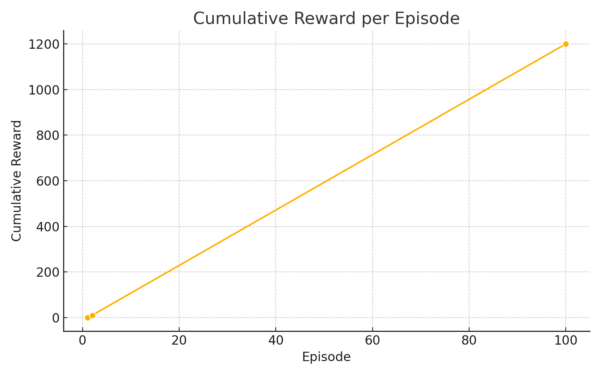
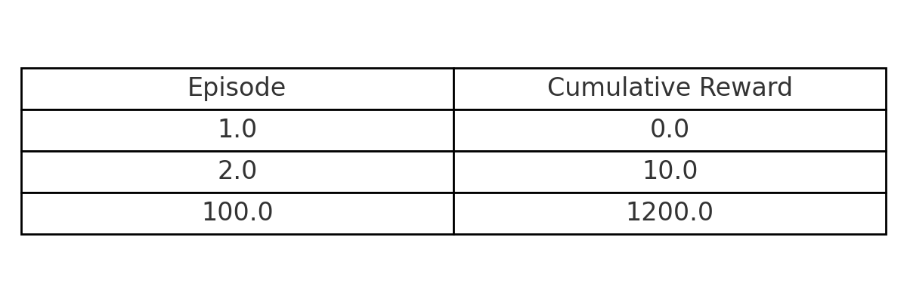

  

<h1 align="center" style="font-weight: bold;"> grocey-backend</h1>

  <a href="#1-project-overview">Overview</a> • 
  <a href="#2-problem-statement">Problem</a> • 
  <a href="#3-why-reinforcement-learning">RL</a> • 
  <a href="#4-tech-stack">Tech</a> • 
  <a href="#5-key-features">Features</a> • 
  <a href="#6-testing-strategy">Testing</a> • 
  <a href="#7-live-demo">Demo</a> • 
  <a href="#8-deployment">Deployment</a> •
<a href="#9-api-documentation">API Docs</a>

### 1. Project Overview
**Grocey** is an AI-powered smart grocery assistant that learns from users' fridge contents and consumption patterns to recommend optimal shopping lists.
The system is designed under the assumption that real-time ingredient data is provided by a smart fridge (e.g., Samsung Bespoke).
Using reinforcement learning, Grocey predicts the ideal purchase timing and suggests items that minimize waste and maximize utility.

For implementation and testing, dummy data was used to simulate realistic scenarios.
To simulate consumption behavior, a post-recommendation event randomly removes a subset of fridge items.  
This mimics ingredient usage, allowing the reinforcement learning agent to observe state transitions and learn effective policies.

### 2. Problem Statement
Traditional supervised learning methods require large volumes of labeled data, which is often impractical in real-world applications. In contrast, **reinforcement learning (RL)** can model user behavior with minimal data by learning through interaction and feedback.
While RL has shown strong results in fields such as gaming and robotics, its application to **everyday decision-making scenarios**—like consumer shopping habits—has been limited.
This project explores how RL can be applied to **optimize grocery shopping behavior** based on real-time fridge inventory data.

**Key motivations:**
* RL excels in environments where **actions influence future states**, aligning well with recurring purchase decisions.
* Fridge data reflects **discrete and time-sensitive states** (e.g., ingredient types, expiration dates), making it suitable for RL modeling.
* The goal is to reduce food waste and improve user convenience through **adaptive, behavior-driven recommendations**.

### 3. Why Reinforcement Learning
To build a personalized grocery recommendation engine, the project adopts a **Deep Q-Network (DQN)**, a value-based reinforcement learning algorithm.
This choice was driven by the nature of the data: **discrete fridge states** (e.g., ingredient availability, expiration dates) and **a manageable action space** (e.g., what to buy next).
**Why DQN?**
* The environment is naturally **discrete and low-dimensional**, making Q-learning a practical fit.
* Unlike tabular Q-learning, which suffers in high-dimensional spaces, DQN uses a neural network to approximate Q-values, enabling generalization across diverse fridge states.
* DQN is computationally efficient and well-suited for real-time inference scenarios, especially on edge-constrained environments like mobile apps or smart appliances.

⠀**Why not Actor-Critic?**
* Actor-Critic methods (e.g., PPO, A3C) are optimized for **continuous or event-driven environments**, such as robotic control or real-time navigation.
* In this project, **state transitions are event-triggered and sparse** (e.g., ingredient addition/removal), and **the reward signal is relatively delayed**, making policy-based methods prone to instability.
* The added complexity and tuning cost of Actor-Critic was not justified given the relatively straightforward state-action structure.

**Reward Design:**
To train the DQN, a reward is assigned based on whether the recommended ingredient was actually consumed.  
This is tracked by comparing fridge snapshots before and after the recommendation.  
If the item was used within a certain time window, a positive reward is given; otherwise, a penalty is applied to encourage more accurate predictions.

#### 📈 Training Progress

To evaluate the learning performance of the DQN agent, we tracked the cumulative reward over episodes:

  

The following table summarizes the learning trend:

  

As seen above, the agent gradually improves its policy over time, achieving significantly higher rewards by episode 100. This confirms the DQN model's ability to learn effective shopping strategies based on state transitions and reward feedback.

In summary, DQN offers a **simple yet effective solution** for modeling sequential decision-making over discrete fridge states.
It enables the system to **adapt over time** based on user behavior, without requiring a large labeled dataset or continuous feedback.
### 4. Tech Stack
#### 🧠 AI & Machine Learning
- **TensorFlow** – Deep Q-Network (DQN) model for reinforcement learning
- **Flask** – Lightweight API server to serve AI recommendations

#### 🛠 Backend
- **Spring Boot** – Core framework for API development
- **Spring Security + JWT** – Stateless authentication with access/refresh tokens
- **JPA (Hibernate)** – ORM for database interaction
- **MySQL** – Relational database for storing user, fridge, and recommendation data

#### 🧪 Testing
- **JUnit 5 + Mockito** – Unit testing for service and repository layers
- **Spring MockMvc** – Integration testing for API endpoints
- **Testcontainers** – Containerized MySQL for reliable, isolated test environments

#### 📱 Frontend
- **React Native** – Mobile-first UI, deployed as a web app for demonstration
- **Firebase Hosting** – Static hosting of the React Native web build

#### ⚙️ DevOps & Infra
- **Docker** – Containerization of backend, database, and AI server
- **AWS EC2** – Hosting environment for backend and AI server containers
- **.env Configuration** – Secure environment variable management across services

### 5. Key Features
#### 🧑‍💼 User & Auth
- Sign up with automatic fridge creation and default items
- JWT-based login (access + refresh tokens)
- Update food preferences and allergies
- Change password, logout, and delete account

#### 🧊 Fridge
- View fridge items (filterable by freezer status)
- Check item details (quantity, expiration, etc.)

#### 🧠 AI Recommendation
- DQN-based grocery suggestions based on user behavior
- Personalized recipe recommendations (fridge-based or preference-based)

#### 🍽️ Recipe Management
- Save recommended recipes to user account
- View list of saved recipes

#### 🛒 Cart & Order
- Add/remove cart items
- Place orders and auto-update fridge inventory
- View recent order history

#### 🧪 Testing
- JUnit + MockMvc for unit tests
- Testcontainers-based integration testing with Dockerized MySQL

 > 🧭 Note:  
> All components of this project—including the backend, frontend, and AI module—were fully developed by myself.  
> However, the frontend and AI parts were intentionally kept minimal, serving only to demonstrate full-stack integration.  
> The backend, where all core business logic resides, is the primary focus of this project.

### 6. Testing Strategy
This project adopts a layered testing strategy to ensure code reliability and system stability.

#### 🧪 Unit Testing
- Core service and repository logic is covered using **JUnit 5** and **Mockito**
- Focuses on edge cases, validation, and exception handling

#### 🧪 Integration Testing
- Full end-to-end API testing is implemented using **Spring Boot's @SpringBootTest** and **MockMvc**
- All tests inherit from a shared **`AbstractIntegrationTest`** class,  
  which provides reusable setup utilities and preconfigured beans for streamlined testing

#### 🐳 Testcontainers
- Integration tests are executed against a **Dockerized MySQL container** using [Testcontainers](https://www.testcontainers.org/)
- Database schema is recreated for each test run using `ddl-auto: create-drop`
- Ensures isolated, reproducible environments that mimic production

### 7. Live Demo
The service is fully deployed and publicly accessible at:  
🔗 **http://grocey-frontend.web.app**

All backend APIs (Spring Boot) and the AI recommendation engine (Flask + TensorFlow) are hosted on AWS EC2 with Docker.  
The frontend (React Native Web) is deployed via Firebase Hosting.

### 8. Deployment
The entire system is fully containerized and deployed using cloud infrastructure.

#### 🧠 AI Server (Flask + TensorFlow)
- Containerized with Docker and deployed on **AWS EC2**
- Exposes REST API for reinforcement learning-based grocery and recipe recommendations
- Uses `.env` for secure database and model configuration

#### 🛠 Backend API (Spring Boot)
- Dockerized Spring Boot application hosted on **AWS EC2**
- Communicates with both MySQL and the AI server over internal network
- Integrated with JWT-based authentication and full CRUD API functionality

#### 🗄️ Database
- **MySQL 8.0** running in a separate Docker container on EC2
- Used for storing all core entities (user, fridge, product, recipe, preferences)

#### 📱 Frontend
- **React Native** project exported as a web build
- Deployed via **Firebase Hosting** for easy public access

#### ⚙️ Infrastructure
- All services are containerized with Docker and orchestrated manually via shell scripts
- Each service exposes appropriate ports and runs with resource-limited configuration (e.g., `--cpus="0.5"` for AI)
- System designed to be reproducible and portable on any Docker-compatible host

### 9. API Documentation
Full API reference including endpoints, parameters, and example responses:  
📄 [View API Docs on Notion](https://www.notion.so/Grocey-API-Docs-1ffdf2486c75803e8921d6669be6e5c0?pvs=4)
