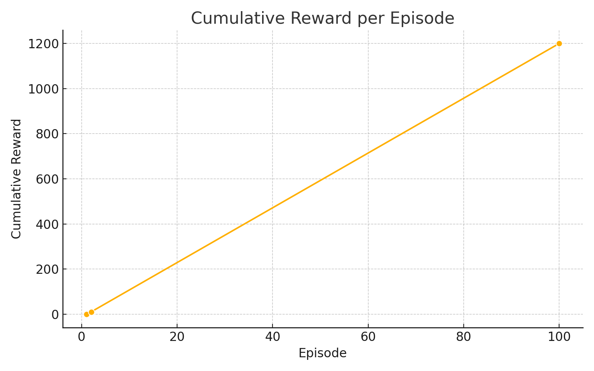
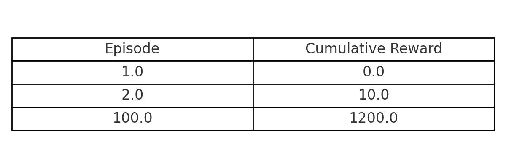
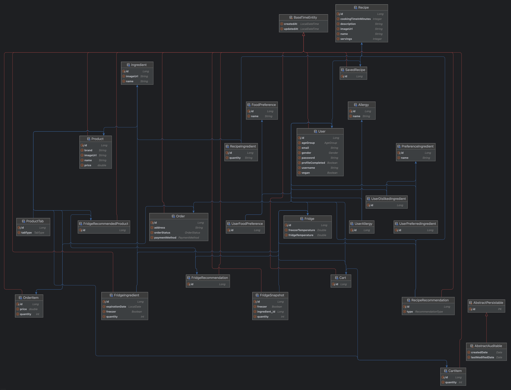

  

<h1 align="center" style="font-weight: bold;">grocey-backend</h1>

  <a href="#1-project-overview">Overview</a> • 
  <a href="#2-problem-definition">Problem</a> • 
  <a href="#3-why-reinforcement-learning">AI</a> • 
  <a href="#4-tech-stack">Stack</a> • 
  <a href="#5-architecture">Architecture</a> • 
  <a href="#6-key-features">Features</a> •
  <a href="#7-api-documentation">API Docs</a> •
  <a href="#8-testing">Testing</a> • 
  <a href="#9-performance-testing">Performance</a> • 
  <a href="#10-deployment">Deployment</a> • 
  <a href="#11-demo">Demo</a>

---

## 1. Project Overview
**Grocey** is an AI-powered smart grocery assistant that learns from the state of a user’s fridge and their consumption patterns to recommend optimized shopping lists.  
It is designed under the assumption of real-time smart fridge data (e.g., Samsung Bespoke), with the goal of **reducing food waste and improving shopping convenience**.

For demonstration, dummy data is used to simulate fridge behavior. Ingredient consumption is automatically simulated by removing items at random, allowing the reinforcement learning agent to observe state changes and learn effective strategies.

---

## 2. Problem Definition
- Traditional supervised learning requires large labeled datasets → not practical in this domain
- Reinforcement learning (RL) can learn from interactions and feedback → effective even with limited data
- RL has shown success in gaming/robotics, but **applications to everyday decision-making (e.g., grocery shopping)** are rare
- This project explores whether fridge data can be leveraged to optimize shopping decisions with RL

---

## 3. Why Reinforcement Learning
To build a personalized grocery recommendation engine, this project adopts the **DQN (Deep Q-Network)** algorithm.

**Why DQN?**
- Discrete environment with relatively low-dimensional state space → Q-learning based approach is suitable
- Overcomes traditional Q-learning limitations by generalizing Q-values with a neural network
- Efficient enough for real-time inference in mobile or IoT environments

**Why not Actor-Critic?**
- Actor-Critic methods (e.g., PPO, A3C) perform well in continuous environments
- In this project, state transitions are event-based (ingredients added/consumed) with delayed rewards, making stability an issue
- Complexity and tuning costs outweigh the benefits → DQN is more practical

**Reward Design**
- Rewards are assigned based on whether recommended ingredients are actually consumed
- Before/after fridge snapshots are compared → consumption = +reward, unused = -reward

#### 📈 Training Performance
The agent’s learning progress was tracked by cumulative rewards:

  

  

As shown in the graph and table, the agent gradually improved its policy over time, achieving significantly higher rewards by the 100th episode compared to the start.  
This demonstrates that DQN can effectively learn grocery shopping strategies based on **state transitions and reward feedback**.

In summary, DQN provides a relatively simple yet effective way to model sequential decision-making problems in a discrete fridge environment. It enables the system to adapt to user behavior over time without requiring large-scale labeled data or continuous manual feedback.

---

## 4. Tech Stack
- **AI**: TensorFlow, Flask (recommendation API server)
- **Backend**: Spring Boot, Spring Security (JWT), JPA, MySQL
- **Infra**: AWS EC2, Docker, environment variable management (.env)
- **Testing**: JUnit5, Mockito, MockMvc, Testcontainers
- **Frontend**: React Native (Web Build), Firebase Hosting

---

## 5. Architecture
- **Layered Architecture** design (Controller → Service → Repository → Domain)
- AI recommendation module is implemented as a separate Flask server, communicating via REST API
- Data model is managed with an ERD (Entity Relationship Diagram)
- For clarity, only a simplified version is shown here; the full ERD is available separately

  

[View Full ERD](../assets/grocey-erd.png)

---

## 6. Key Features
- **Auth/User**: Auto fridge creation at signup, JWT login, update preferences/allergies
- **Fridge**: View ingredient list (with freezer filter), check ingredient details
- **AI Recommendation**: DQN-based grocery & recipe recommendations
- **Recipes**: Save and view recommended recipes
- **Cart/Orders**: Manage shopping cart and place orders

---

## 7. API Documentation
Key endpoint examples:

| Method | Endpoint                                | Description                      |
|--------|-----------------------------------------|----------------------------------|
| POST   | `/api/auth/signup`                      | Sign up and issue JWT            |
| POST   | `/api/auth/login`                       | Login and issue JWT              |
| GET    | `/api/fridge/ingredients`               | Get fridge ingredient list       |
| GET    | `/api/products`                         | Get product list by category     |
| GET    | `/api/orders/summary`                   | Get recent order summary         |
| POST   | `/api/orders`                           | Create order from cart items     |
| GET    | `/api/recipes/{recipeId}`               | Get recipe details               |
| GET    | `/api/recipes/recommendations/fridge`   | Get fridge-based recipe recs     |
| GET    | `/api/recipes/recommendations/personal` | Get personalized recipe recs     |

Detailed request/response examples can be found in the [API Spec](api-spec.en.md).

---

## 8. Testing
- Unit tests: JUnit5 + Mockito
- Integration tests: Spring Boot + MockMvc
- Testcontainers with MySQL → isolated environment close to production

---

## 9. Performance Testing

### Purpose
- Validate concurrent request handling of key APIs
- Measure effects of Redis caching and DB indexing

### Environment
- **Server**: AWS EC2 (Spring Boot, MySQL, Redis, Docker)
- **DB Connection Pool**: HikariCP (default settings)
- **Tool**: k6

### Scenario
- Virtual Users (VUs): 50 → 100 step load test
- Target Endpoints: `/products`, `/recipes`, `/ingredients`, `/fridge`, `/recommendations`
- Success Criteria: P95 < 500ms, error rate < 2%

### Results

| Endpoint        | VUs | Cache | Index | Avg (ms) | P95 (ms) | Max (ms) | Error Rate |
|-----------------|-----|-------|-------|----------|----------|----------|------------|
| Products        | 50  | OFF   | OFF   | ~652     | ~1340    | 2259     | 0%         |
| Products        | 50  | ON    | OFF   | ~391     | ~1094    | 1888     | 0%         |
| Products        | 50  | ON    | ON    | ~778     | ~1494    | 3611     | 0%         |
| Products        | 100 | ON    | ON    | ~1593    | ~3296    | 5925     | 0%         |
| Recipes         | 100 | OFF   | -     | ~2062    | ~3757    | 6508     | 0%         |
| Recipes         | 100 | ON    | -     | ~1592    | ~3198    | 6164     | 0%         |
| Ingredients     | 100 | OFF   | -     | ~2018    | ~3700    | 5144     | 0%         |
| Ingredients     | 100 | ON    | -     | ~2544    | ~5051    | 7419     | 0%         |
| Fridge          | 100 | ON    | -     | ~1608    | ~3392    | 4998     | 0%         |
| Recommendations | 100 | ON    | -     | ~3189    | ~5720    | 9847     | 0%         |

### Insights
- **Products**: Cache + Index → 30–40% improvement
- **Recipes**: Cache ON → ~22% faster on average, P95 reduced
- **Ingredients**: Cache ON degraded performance → better without caching
- **Fridge**: Cache ON helped handle multi-user load
- **Recommendations**: No cache benefit due to AI processing bottleneck

### Conclusion
Index optimization and Redis caching minimized performance degradation under heavy load.  
However, caching effects varied by endpoint, and unnecessary caching could actually **worsen performance**.

---

## 10. Deployment

This service is fully containerized with Docker and deployed on AWS EC2.  
Each component runs in its own container, with environment variables injected via the `-e` option.

### Backend API
- Spring Boot application containerized and deployed to EC2
- Communicates internally with MySQL, Redis, and AI server

### Database
- MySQL 8.0 container
- Stores core entities: users, fridge, recipes, orders, preferences

### AI Server
- Flask + TensorFlow recommendation server
- Containerized and deployed to EC2, provides REST APIs to backend

### Cache Server
- Redis container
- Caches frequent queries for products, recipes, and fridge ingredients

### Frontend
- React Native app built for web and deployed to Firebase Hosting
- Interacts directly with backend APIs

### Infrastructure
- Containers manually managed on AWS EC2 (Ubuntu) with `docker run …`
- Secrets (DB credentials, JWT keys, AI configs) passed as environment variables

---

## 11. Demo

🔗 **http://grocey-frontend.web.app**

> ⚠️ Note: The demo does not connect to an actual smart fridge.  
> Instead, it runs on **dummy data with a simulated fridge environment**, where ingredients are automatically consumed over time.  
> This allows the reinforcement learning agent to observe state transitions and adjust its policy accordingly,  
> while keeping the system flexible enough to be applied to real-world scenarios.
