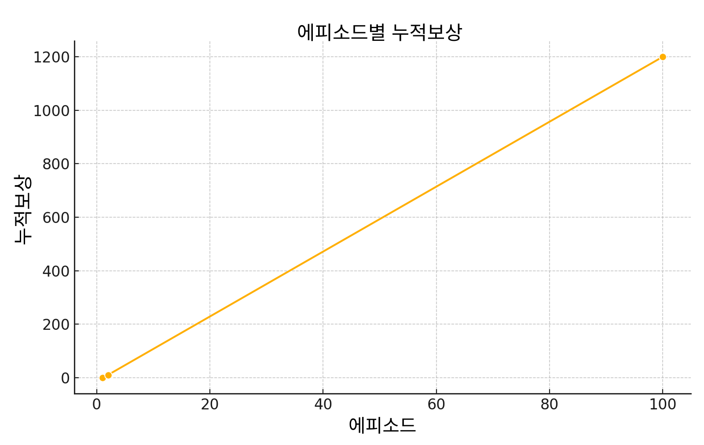
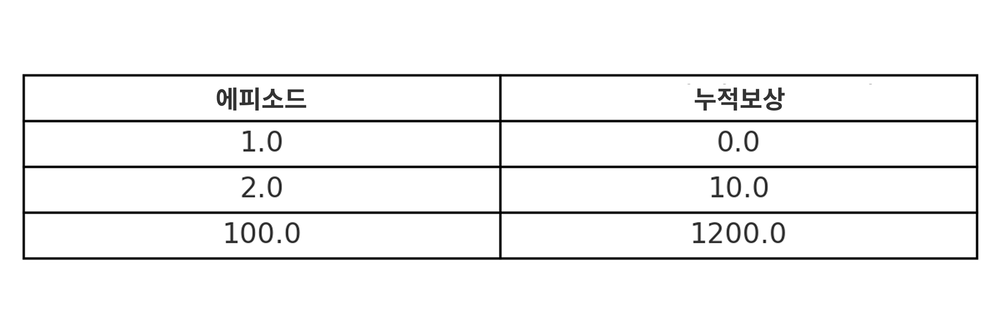

<p align="center">
  
</p>
<h1 align="center" style="font-weight: bold;"> grocey-backend</h1>

<p align="center">
  <a href="#1-프로젝트-개요">개요</a> • 
  <a href="#2-문제-정의">문제</a> • 
  <a href="#3-강화학습-선택-이유">AI</a> • 
  <a href="#4-기술-스택">스택</a> • 
  <a href="#5-아키텍처">아키텍처</a> • 
  <a href="#6-주요-기능">기능</a> •
  <a href="#7-api-문서">API 문서</a> •
  <a href="#8-테스트">테스트</a> • 
  <a href="#9-성능-테스트">성능 테스트</a> • 
  <a href="#10-배포">배포</a> • 
  <a href="#11-데모">데모</a> •
</p>

---

## 1. 프로젝트 개요
**Grocey**는 는 사용자의 냉장고 상태와 소비 패턴을 학습하여 최적의 장보기 목록을 추천하는 AI 기반 스마트 비서입니다.
스마트 냉장고 데이터를 활용한다는 가정 아래 설계되었으며, 음식물 낭비를 줄이고 장보기 편의성을 높이는 것을 목표로 합니다.

구현 단계에서는 더미 데이터를 활용하여 실제 환경을 시뮬레이션했고, 소비 행위는 재료 일부를 무작위로 제거하는 방식으로 모델 학습을 유도했습니다.

---

## 2. 문제 정의
- 기존 지도학습은 대규모 라벨 데이터가 필요 → 현실적 적용 어려움
- 강화학습(RL)은 상호작용과 피드백만으로 모델링 가능 → 데이터가 적어도 적용 가능성 높음
- 게임/로보틱스에는 성과가 있으나, 일상적 의사결정(장보기) 적용 사례는 드묾
- 본 프로젝트는 냉장고 데이터를 활용해 장보기 최적화 가능성을 탐구

---

## 3. 강화학습 선택 이유
이 프로젝트는 맞춤형 장보기 추천 엔진을 구축하기 위해 **DQN(Deep Q-Network)** 알고리즘을 채택했습니다.

**DQN 선택 이유**
* 환경이 불연속적이고 상태 차원이 낮아 Q-learning 기반 접근이 적합
* 전통적인 Q-learning의 한계를 보완하여, 신경망을 통해 다양한 상태에 대해 Q-value 일반화 가능
* 실시간 추론이 필요한 환경(모바일 앱, IoT 기기)에 적합할 정도로 계산 효율성 확보

**Actor-Critc을 사용하지 않은 이유**
* Actor-Critic 계열(PPO, A3C 등)은 연속적 환경이나 이벤트 기반 제어에 강점
* 본 프로젝트의 상태 변화는 이벤트 기반(재료 추가/소비)이며, 보상 신호가 지연되는 특성상 불안정해질 수 있음
* 복잡도와 튜닝 비용에 비해 DQN이 더 실용적

**보상 설계**
추천된 재료가 실제 소비되었는지 여부에 따라 보상을 부여했습니다.  
추천 전후 냉장고 상태 스냅샷을 비교하여, 사용 시 +보상, 미사용 시 -보상을 주는 방식으로 정책 학습을 유도했습니다.

#### 📈 학습 성능
DQN 에이전트의 학습 과정을 누적 보상 기준으로 추적했습니다:

<p align="center">
  
</p>

<p align="center">
  
</p>

위 그래프와 표에서 볼 수 있듯이, 에이전트는 에피소드가 진행됨에 따라 점진적으로 정책을 개선하며 보상을 꾸준히 높였습니다. 100번째 에피소드에서는 초기 대비 크게 향상된 성능을 달성했으며, 이는 DQN이 상태 전이와 보상 피드백을 기반으로 효과적인 장보기 전략을 학습할 수 있음을 보여줍니다.

요약하면, DQN은 비교적 단순하면서도 효과적인 방식으로 이산적인 냉장고 상태에 따른 순차적 의사결정 문제를 모델링할 수 있습니다. 이를 통해 대규모 라벨링 데이터나 지속적인 사용자 피드백 없이도, 시간이 지남에 따라 사용자 행동에 적응하는 시스템을 구현할 수 있음을 확인했습니다.

---

## 4. 기술 스택
- **AI**: TensorFlow, Flask (추천 API 서버)
- **Backend**: Spring Boot, Spring Security (JWT), JPA, MySQL
- **Infra**: AWS EC2, Docker, 환경변수 관리(.env)
- **Test**: JUnit5, Mockito, MockMvc, Testcontainers
- **Frontend**: React Native (Web Build), Firebase Hosting
---

## 5. 아키텍처
- **Layered Architecture** 기반 설계 (Controller → Service → Repository → Domain)
- AI 추천 모듈은 별도 Flask 서버로 분리, REST API 형태로 통신
- 데이터 모델은 ERD(Entity Relationship Diagram)로 관리
- ERD 전체 구조는 복잡하므로, README에서는 축소 버전을 제공하고 세부 사항은 원본에서 확인 가능

<p align="center">
  
</p>

[ERD 원본 전체 보기](../assets/grocey-erd.png)

---

## 6. 주요 기능

- **인증/사용자**: 회원가입 시 자동 냉장고 생성, JWT 로그인, 선호/알러지 업데이트
- **냉장고**: 재료 목록 조회(냉동 여부 필터링), 상세 정보 확인
- **AI 추천**: DQN 기반 장보기/레시피 추천
- **레시피**: 추천 레시피 저장 및 조회
- **장바구니/주문**: 주문 및 장바구니 관리
---
## 7. API 문서
주요 엔드포인트 예시:

| Method | Endpoint                                   | Description             |
|--------|--------------------------------------------|-------------------------|
| POST   | `/api/auth/signup`                         | 회원가입 및 JWT 발급    |
| POST   | `/api/auth/login`                          | 로그인 및 JWT 발급      |
| GET    | `/api/fridge/ingredients`                  | 냉장고 재료 목록 조회    |
| GET    | `/api/products`                            | 탭별 상품 목록 조회      |
| GET    | `/api/orders/summary`                      | 최근 주문 요약 조회      |
| POST   | `/api/orders`                              | 주문 생성 (장바구니 기반)|
| GET    | `/api/recipes/{recipeId}`                  | 레시피 상세 조회         |
| GET    | `/api/recipes/recommendations/fridge`      | 냉장고 기반 레시피 추천  |
| GET    | `/api/recipes/recommendations/personal`    | 개인화 레시피 추천       |

상세 요청/응답 예시는 [API 명세서](api-spec.ko.md)에서 확인 가능합니다.

---

## 8. 테스트
- 단위 테스트: JUnit5 + Mockito
- 통합 테스트: Spring Boot + MockMvc
- Testcontainers 기반 MySQL 환경 → 운영과 유사한 격리된 환경 제공
```bash
./gradlew test
```

---

## 9. 성능 테스트

### 목적
- 주요 API 동시 접속 처리 성능 검증
- Redis 캐시 및 인덱스 적용 효과 측정

### 환경
- **Server**: AWS EC2 (Spring Boot, MySQL, Redis, Docker)
- **DB Connection Pool**: HikariCP (default 설정)
- **Tool**: k6

### 시나리오
- Virtual Users (VUs): 50 → 100 단계별 부하 테스트
- Target Endpoints: `/products`, `/recipes`, `/ingredients`, `/fridge`, `/recommendations`
- Success Criteria: P95 응답 시간 < 500ms, 실패율 < 2%

### 결과

| Endpoint        | VUs | Cache | Index | Avg (ms) | P95 (ms) | Max (ms) | Error Rate |
|-----------------|-----|-------|-------|----------|----------|----------|------------|
| Products        | 50  | OFF   | OFF   | ~652     | ~1340    | 2259     | 0%         |
| Products        | 50  | ON    | OFF   | ~391     | ~1094    | 1888     | 0%         |
| Products        | 50  | ON    | ON    | ~778     | ~1494    | 3611     | 0%         |
| Products        | 100 | ON    | ON    | ~1593    | ~3296    | 5925     | 0%         |
| Recipes         | 100 | OFF   | -     | ~2062    | ~3757    | 6508     | 0%         |
| Recipes         | 100 | ON    | -     | ~1592    | ~3198    | 6164     | 0%         |
| Ingredients     | 100 | OFF   | -     | ~2018    | ~3700    | 5144     | 0%         |
| Ingredients     | 100 | ON    | -     | ~2544    | ~5051    | 7419     | 0%         |
| Fridge          | 100 | ON    | -     | ~1608    | ~3392    | 4998     | 0%         |
| Recommendations | 100 | ON    | -     | ~3189    | ~5720    | 9847     | 0%         |

### 분석 및 인사이트
- **Products**: Cache ON + Index 적용 시 평균 응답속도 약 30~40% 개선
- **Recipes**: Cache ON → 평균 응답속도 약 22% 개선, P95도 감소
- **Ingredients**: Cache ON 적용 시 성능 저하 발생 → 캐시 제거가 유리
- **Fridge**: Cache 유지 시 다중 사용자 부하 대응에 유리
- **Recommendations**: AI 연동 병목이 원인 → 캐시 효과 없음

### 결론
- 인덱스 최적화와 Redis 캐시 전략을 통해 고부하 환경에서도 성능 저하를 최소화할 수 있음을 검증
- 엔드포인트별로 캐시 효과가 다름을 확인하였으며, **불필요한 캐시는 오히려 성능 저하를 유발할 수 있음**


---

## 10. 배포

이 서비스는 Docker 기반으로 컨테이너화하여 AWS EC2에 배포되었습니다.  
각 구성 요소는 개별 컨테이너로 실행되며, 실행 시 `-e` 옵션을 통해 환경 변수를 주입합니다.

### 백엔드 API
- Spring Boot 애플리케이션을 Docker 이미지로 빌드 후 EC2에 배포
- 내부 네트워크를 통해 데이터베이스, AI 서버, 캐시 서버와 연결

### 데이터베이스
- MySQL 8.0 컨테이너 실행
- 사용자, 냉장고, 레시피, 주문, 선호도 등 핵심 데이터 저장

### AI 서버
- Flask + TensorFlow 기반 추천 서버
- Docker 컨테이너로 EC2에 배포, REST API 형태로 백엔드와 통신

### 캐싱 서버
- Redis 컨테이너 실행
- 상품/레시피/냉장고 조회 요청을 캐싱하여 응답 속도 최적화

### 프론트엔드
- React Native 애플리케이션을 Web Build 후 Firebase Hosting에 배포
- API 호출은 백엔드(Spring Boot)와 직접 연동

### 인프라
- AWS EC2(Ubuntu)에서 각 컨테이너를 직접 관리 (`docker run …` 방식)
- 실행 시 `-e` 옵션으로 DB 비밀번호, JWT 시크릿, AI 서버 환경 변수 등 민감 정보를 주입

---


## 11. 데모
  
🔗 **http://grocey-frontend.web.app**

> ⚠️ 주의: 현재 데모는 실제 스마트 냉장고 데이터가 아닌 **더미 데이터를 기반으로 동작**합니다.  
> 냉장고 환경을 시뮬레이션하기 위해, 재료가 일정 규칙에 따라 **자동으로 소비되는 방식**으로 구현되어 있습니다.  
> 이를 통해 강화학습 에이전트가 상태 변화를 관찰하고 학습할 수 있도록 설계되었으며,  
> 실제 환경에서도 동일한 로직이 적용될 수 있도록 구조화되어 있습니다.

